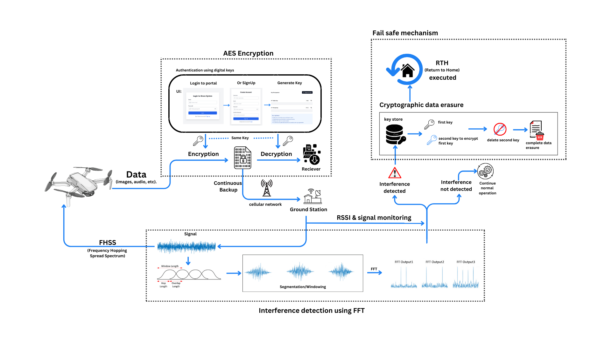

<h1 align ="left">
  Kavach
</h1>

<h3 align ="left">
  An Innovative AI project designed to push the boundaries of technology and drive transformative change in the drone industry.
</h3>

## Growing Drone Security Crisis

⭕ Drone jamming incidents have risen 35% annually, disrupting operations.  
⭕ Loss of control causes 25% of drone crashes and 30% of unauthorized access events.  
⭕ Malicious drone use leads to $1.5B in damages annually.  
⭕ Traditional security fails with only 40% detection success.  
⭕ Real-time detection can improve recovery rates by 70%. 

 
 

## Key features
1.AES encryption and authentication  
2.FFT based signal monitoring and Continuous data backup  
3.FHSS (Frequency Hopping Spread Spectrum)  
4.Instant Failsafe mechanism ( cryptographic data erasure followed by RTH)  

